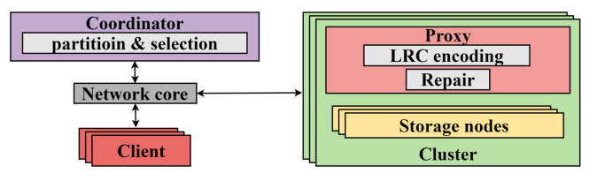

## 环境要求
- 需要支持C++20的编译环境
- 作者测试使用过的最低编译器版本是gcc 11.1.0 
## 下载仓库
```
cd ~

git clone https://github.com/ptbxzrt/happylrc.git

cd happylrc

mkdir 3rd_party

cd 3rd_party

mkdir yalantinglibs gf-complete Jerasure hiredis redis-plus-plus redis
```

## 安装依赖
### 1. yalantinglibs
用于socket网络通信和rpc调用
```
cd ~

sudo apt-get install libprotobuf-dev protobuf-compiler libprotoc-dev

git clone https://github.com/alibaba/yalantinglibs.git

cd yalantinglibs

mkdir build && cd build

# 安装在happylrc的3rd_party目录下
cmake .. -DCMAKE_INSTALL_PREFIX=~/happylrc/3rd_party/yalantinglibs

# yalantinglibs是header only的库, 直接安装即可, 无需编译
# 安装时报错可以忽略, 只要相关头文件被复制到指定文件夹即可
# 安装完成后, 这些头文件应该在~/happylrc/3rd_party/yalantinglibs/include中
cmake --install .
```

### 2. gf-complete和Jerasure
用于纠删码编解码
```
cd ~

git clone https://github.com/ceph/gf-complete.git

cd gf-complete

autoreconf -if

./configure --prefix=~/happylrc/3rd_party/gf-complete

make -j

make install
```
```
cd ~

git clone https://github.com/tsuraan/Jerasure.git

cd Jerasure

autoreconf -if

./configure --prefix=~/happylrc/3rd_party/Jerasure

make -j

make install
``` 

### 3. hiredis和redis-plus-plus
用作redis客户端
```
cd ~

git clone https://github.com/redis/hiredis.git

cd hiredis

make PREFIX=~/happylrc/3rd_party/hiredis

make PREFIX=~/happylrc/3rd_party/hiredis install
```
```
cd ~

git clone https://github.com/sewenew/redis-plus-plus.git

cd redis-plus-plus

mkdir build && cd build

# CMAKE_PREFIX_PATH指定已经安装的hiredis的安装路径, CMAKE_INSTALL_PREFIX设置redis-plus-plus将被安装的路径
cmake -DCMAKE_PREFIX_PATH=~/happylrc/3rd_party/hiredis -DCMAKE_INSTALL_PREFIX=~/happylrc/3rd_party/redis-plus-plus ..

cmake --build . -j8

cmake --install .
```

### 4. redis
用作底层的kv存储系统
```
cd ~

git clone https://github.com/redis/redis.git

cd redis

make PREFIX=~/happylrc/3rd_party/redis install
```


## 编译和运行
提供了用于单机测试的运行脚本, 若需要部署到集群测试, 需要额外编写脚本
```
cd ~/happylrc

source compile.sh
```
```
// 杀掉进程, 这里需要注意不要将其他同学启动的重要进程杀掉, 如其他同学启动的redis-server
kill -9 $(pidof run_datanode);kill -9 $(pidof run_proxy);kill -9 $(pidof redis-server);kill -9 $(pidof run_coordinator);kill -9 $(pidof run_client)

sh run_redis.sh

sh run_datanode_and_proxy.sh

./build/run_coordinator

./build/run_client Azure_LRC strategy_ICPP23_IGNORE_LOAD 12 4 5 1000 4096
```

## 架构
- client: 客户端
- coordinator: 保存所有元数据; 制定放置策略; 制定修复策略; 协调proxy进行读、写、修复操作;
- proxy: 每个cluster有1个proxy, 是该cluster与外界通信的媒介
- datanode: 存储数据

